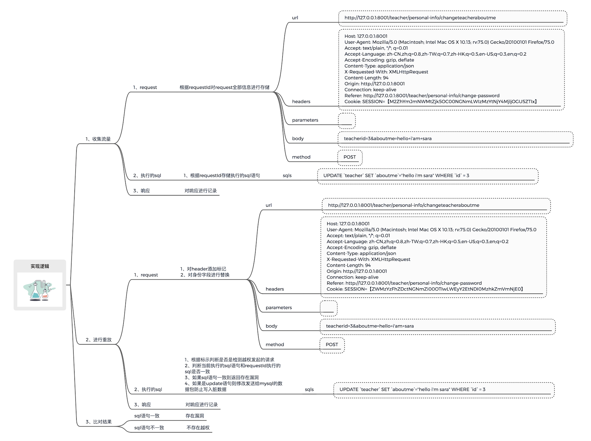
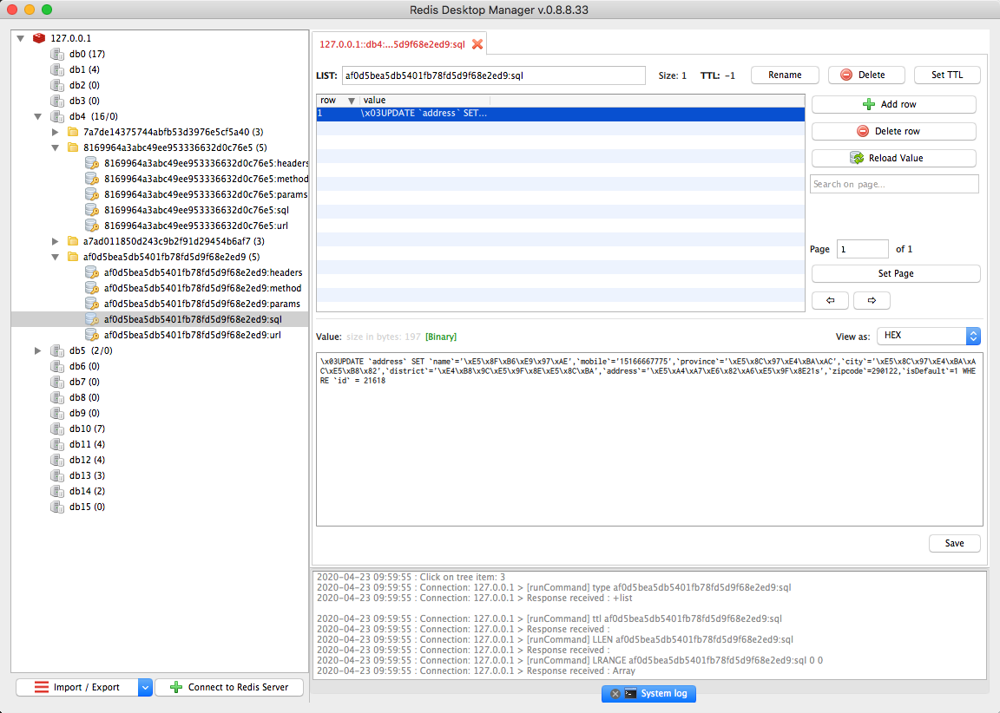
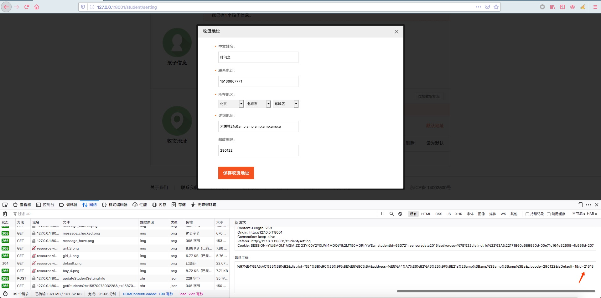
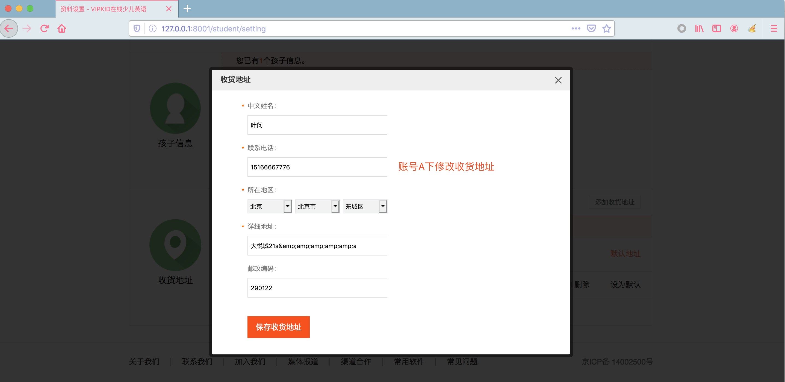
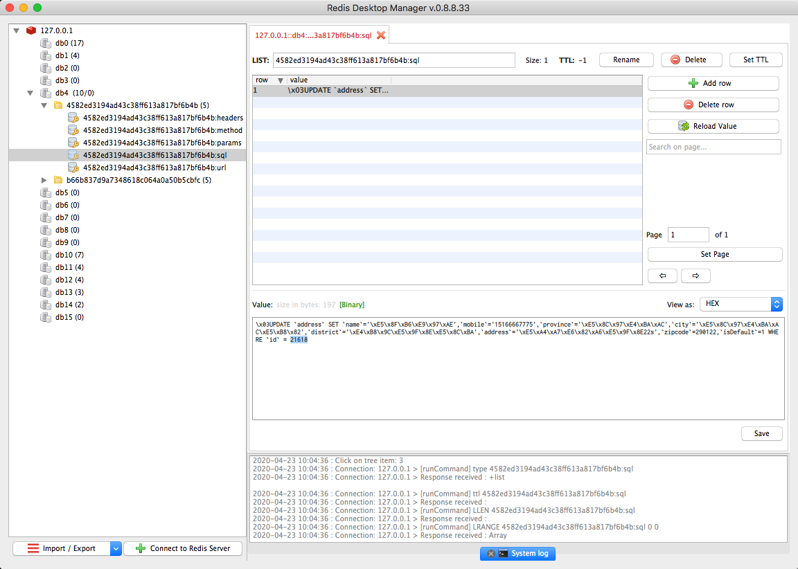

# 基于数据流的越权检测

> 随着技术的发展和安全技术的普及，在大部分互联网企业web安全漏洞可能出现在业务逻辑上的漏洞比较突出，尤其是越权问题，黑盒测试会带来大量脏数据，同时白盒扫描让人无法接受的误报率、代码审计的低效率都是挖掘越权漏洞的大山，那么能不能有更好的思路解决这些问题是我一直在思考的一个问题。

## 0x1 找到问题

>随着研发-测试流程的完善，大部分测试部门的同学会在新的代码部署到测试环境以后会进行功能测试，在进行功能测试的同时安全同学可以通过抓取流量，然后通过对流量进行回放实现部分漏洞的检测，比如我们经常对get类型的请求做sql注入检测，还可以通过替换身份信息进行普通的未授权、越权检测，通过以上我们应该也可以发现一些问题，那么实际生产中存在大量的需要和数据库进行交互的场景，比如修改个人信息、修改收货地址、添加收货地址、删除收获地址类似的场景，针对这些类型的越权检测大部分安全同学可能是申请两个账号然后进行测试，然后通过比对返回的结果判断是否存在越权，以上也可以实现自动化检测，无非是替换身份认证字段重放请求，但是以上检测方法会存在一些问题，比如可能会带来大量脏数据然后对qa的测试会产生一定的影响，想想以前针对post类型的注入是不是加过 **or 1=1**，那么有没有方法解决这些问题呢，下面就是我的一些思考

## 0x2 如何判断是否存在漏洞

> 首先思考下我们在日常挖洞的时候是如何判断一个接口是否存在安全问题的

先拿post类型的sql注入来讲，假如存在一个场景是修改自己的address，我们截获的请求如下

```
POST /rest/parentrest/api/pc/address/update HTTP/1.1
Host: 127.0.0.1:8001
User-Agent: Mozilla/5.0 (Macintosh; Intel Mac OS X 10.13; rv:75.0) Gecko/20100101 Firefox/75.0
Accept: image/webp,*/*
Accept-Language: zh-CN,zh;q=0.8,zh-TW;q=0.7,zh-HK;q=0.5,en-US;q=0.3,en;q=0.2
Accept-Encoding: gzip, deflate
Connection: keep-alive
Cookie: SESSION=SSSIONFORSARA;

username=sara&address=china+beijing
```

假设可以拦截到执行的sql，那么sql语句应该如下

>UPDATE users SET address = "china+beijing" WHERE username = "sara" 

那么我们要判断username字段是否存在注入，我们可以修改username=sara"+and+"1

```
POST /rest/parentrest/api/pc/address/update HTTP/1.1
Host: 127.0.0.1:8001
User-Agent: Mozilla/5.0 (Macintosh; Intel Mac OS X 10.13; rv:75.0) Gecko/20100101 Firefox/75.0
Accept: image/webp,*/*
Accept-Language: zh-CN,zh;q=0.8,zh-TW;q=0.7,zh-HK;q=0.5,en-US;q=0.3,en;q=0.2
Accept-Encoding: gzip, deflate
Connection: keep-alive
Cookie: SESSION=SSSIONFORSARA;


username=sara"+and+"1&address=china+beijing
```
假设后端存在sql拼接，那么sql语句可能是这样子的
>UPDATE users SET address = "china+beijing" WHERE username = "sara" and "1" 

很明显这样就拼接成了一条可以执行的sql语句，然后会提交给数据库去执行了
通过以上分析对以上的简单案例其实我们可以看到我们只要拿到执行的sql语句基本就可以判断是否存在注入了，而无需让sql继续去提交给数据库引擎去执行，在做安全评估时经常会遇到的一个问题就是担心产生脏数据，举个例子，假如开发同学对username做了过滤，假设只留了or "1可以提交通过，那么在我们进行测试的时候就有风险把其他人的信息全部改掉，相信身边人有遇到过通过加 or 1=1把表中全部信息都改掉的光辉历史，那么假如我们可以获取到提交请求的详细信息以及这些请求带来了哪些数据交互也就是执行了哪些sql语句，我们是不是可以做更多的事情呢？比如：

* 使用原身份替换username的值为 username=sara" and "iast，判断拦截的sql语句是否存在拼接
* 替换身份进行重放,记录/拦截update的sql语句判断是否存在越权
* 拦截扫描器请求带来的update类型sql语句

今天重点分析越权检测所以我们继续拿越权漏洞做例子讲
假如我们替换了身份认证字段 

**Cookie ：SESSION=SSSIONFORBOB**

```
POST /rest/parentrest/api/pc/address/update HTTP/1.1
Host: 127.0.0.1:8001
User-Agent: Mozilla/5.0 (Macintosh; Intel Mac OS X 10.13; rv:75.0) Gecko/20100101 Firefox/75.0
Accept: image/webp,*/*
Accept-Language: zh-CN,zh;q=0.8,zh-TW;q=0.7,zh-HK;q=0.5,en-US;q=0.3,en;q=0.2
Accept-Encoding: gzip, deflate
Connection: keep-alive
Cookie: SESSION=SSSIONFORBOB;


username=sara&address=china+beijing
```

假设不存在越权那么开发同学应该会通过session中获取用户的信息标示作为条件执行update，比如从session中获取用户id

>UPDATE users SET address = "china+beijing" WHERE id = 12

假设存在越权那么where条件中的信息应该来自我们提交的参数username
 
>UPDATE users SET address = "china+beijing" WHERE username="sara"

通过比对替换身份认证以后执行的sql语句就可以判断是否存在越权，


## 0x3 技术实现

大体思路先梳理下


技术上主要解决一下几个问题

* 流量处理（获取、清洗、去重）
* 请求标记、重放
* 判断sql是否一致
* 拦截update类型sql语句

### 0x301 数据流信息处理

> 这里的数据流信息不仅包括http请求的流量，还包括执行的sql语句、sql执行完返回的对象信息，为了能够标示我们发起的请求对应执行了哪些sql，我们需要在请求中添加自定义的标示比如requestID，所有的http信息、sql语句信息、sql执行完返回的对象信息都可以通过requestId进行存储和查询

下面简单说下各种信息该如何获取以及处理思路

#### http信息
http请求的信息大家比较熟悉，对http请求的信息进行了拆分存储

* headers     
* url
* method
* body
* parameters
 

#### sql语句处理

sql的处理主要包括以下三点

* 记录
* 判断前后两个请求sql语句是否相同
* 拦截update类型sql语句防止产生脏数据

我们拿 mysql-connector-java-8.0.13.jar 举例，在 **com.mysql.cj.NativeSession** 类中的 **execsql** 方法中可以看到参数有一个 **packet**，这个其实就是我们发送给 **mysql** 的执行的 **sql** 语句数据，然后看了下 **NativePacketPayload** 类发现可以通过**packet.setByteBuffer( byte[] bytes)** 方法修改 **packet** 的值，此时检测到扫描器发起的请求如果包含 **update** 类型的 **sql** 语句则可以对 **packet** 进行篡改。

> com.mysql.cj.NativeSession.java 中 execSQL方法对应的部分代码

```
public <T extends Resultset> T execSQL(Query callingQuery, String query, int maxRows, NativePacketPayload packet, boolean streamResults,
            ProtocolEntityFactory<T, NativePacketPayload> resultSetFactory, String catalog, ColumnDefinition cachedMetadata, boolean isBatch) {
            
        //可以在此处通过插桩插入检测的代码

        long queryStartTime = 0;
        int endOfQueryPacketPosition = 0;
        if (packet != null) {
            endOfQueryPacketPosition = packet.getPosition();
        }

        if (this.gatherPerfMetrics.getValue()) {
            queryStartTime = System.currentTimeMillis();
        }

        this.lastQueryFinishedTime = 0; // we're busy!

        if (this.autoReconnect.getValue() && (getServerSession().isAutoCommit() || this.autoReconnectForPools.getValue()) && this.needsPing && !isBatch) {
            try {
                ping(false, 0);
                this.needsPing = false;

            } catch (Exception Ex) {
                invokeReconnectListeners();
            }
        }
...
```

在openrasp中可以编写自定义的编码转换器SqlTransformer2类插入到EngineBoot类的initTransformer方法中，可以实现将 **requestId** 和 **sql** 语句一起存储到redis中，当然还需要各位自己写下com.baidu.openrasp.hook.InsertRedis.InsertInfoToRedis()类用于往 **redis** 中写入数据


> SqlTransformer2.java

```
package com.baidu.openrasp.hook.molice;

import javassist.*;

import java.lang.instrument.ClassFileTransformer;
import java.security.ProtectionDomain;


/**
 * Description
 * <p>
 * </p>
 * DATE 2020/4/5.
 *
 * @author molice.
 */
public class SqlTransformer2 implements ClassFileTransformer {
    /*
     * 记录/拦截执行的update语句
     * todo 根据requestId判断请求是否来自扫描器
     * todo 如果不是来自扫描器则记录执行的sql语句，并对返回结果进行序列化操作
     * todo 如果判断是来自扫描器，则记录sql语句并对存储的原始数据进行反序列化并返回该对象，保证在不和数据库进行交互的前提下完成业务流程
     *
     * */

    @Override
    public byte[] transform(final ClassLoader loader, final String className, final Class <?> classBeingRedefined, final ProtectionDomain protectionDomain, final byte[] classfileBuffer) {
//        if ("com/mysql/cj/jdbc/ClientPreparedStatement".equals( className )) {

        if ("com/mysql/cj/NativeSession".equals( className )) {
            try {
                //1、所引用的类型，必须通过ClassPool获取后才可以使用
                //2、代码块中所用到的引用类型，使用时必须写全量类名
                final CtClass clazz = ClassPool.getDefault().get( className.replace( "/", "." ) );
                System.out.println( "className is :" + clazz.getName() );
                CtMethod executeUpdateInternal = clazz.getDeclaredMethod( "execSQL" );
                executeUpdateInternal.insertBefore( "" +
                                "com.baidu.openrasp.request.AbstractRequest request = com.baidu.openrasp.HookHandler.requestCache.get();" +
                                "com.mysql.cj.protocol.a.NativePacketPayload pack = $4;" +
                                "String currentSql = String.valueOf(pack);" +
                                "if (pack != null){String resultStr = (new com.baidu.openrasp.hook.molice.DetectAuthorityVunlClass()).detect(request, currentSql);" +
                                "if (resultStr.equals(\"1\")){int len = pack.getPayloadLength();byte[] b = new byte[len];byte[] c = pack.getByteBuffer();" +
                                "if (c[1] == 85) {b[1] = 115;pack.setByteBuffer( b );}}}"
                );
                // 返回字节码，并且detachCtClass对象
                byte[] byteCode = clazz.toBytecode();
                //detach的意思是将内存中曾经被javassist加载过的Date对象移除，如果下次有需要在内存中找不到会重新走javassist加载
                clazz.detach();
                return byteCode;
            } catch (Exception ex) {
                ex.printStackTrace();
            }
        }
        // 如果返回null则字节码不会被修改
        return null;
    }


}
```

> DetectAuthorityVunlClass类

```
package com.baidu.openrasp.hook.molice;

import com.baidu.openrasp.hook.InsertRedis.SelectInfoFromRedis;
import com.baidu.openrasp.hook.InsertRedis.InsertInfoToRedis;
import com.baidu.openrasp.request.AbstractRequest;

/**
 * Description
 * <p>
 * </p>
 * DATE 2020/4/18.
 *
 * @author molice.
 */
public class DetectAuthorityVunlClass {
    public String detect(AbstractRequest request, String bytes) {

        String currentSql = hexStr2Str( bytes );
        String ua = request.getHeader( "user-agent" );
        //记录当前requestId检测检测的sql偏移
        InsertInfoToRedis insertInfoToRedis = new InsertInfoToRedis();
        // 首先判断请求是否来自扫描器
        if (ua.contains( "TestBySecurityTeamForVunl" )) {
            System.out.println( "匹配到了发起的检测请求，开始执行越权判断的逻辑" );
            //记录当前requestId检测检测的sql偏移
            insertInfoToRedis.setSqlCount( request.getRequestId() );

            String[] uaSplited = ua.split( "-" );
            String origRequestid = uaSplited[1];
            // 根据执行的sql语句是否一致存在漏洞
            com.baidu.openrasp.hook.InsertRedis.SelectInfoFromRedis getInfoFromRedis = new com.baidu.openrasp.hook.InsertRedis.SelectInfoFromRedis();
            int sqlIndex = insertInfoToRedis.getSqlCount( request.getRequestId() ) - 1;
            System.out.println( "index:" + sqlIndex );
            if (sqlIndex < 0) {
                sqlIndex = 1;
            }
            String oriGSql = getInfoFromRedis.getSqlString( origRequestid, sqlIndex );

            if (currentSql.equals( oriGSql )) {
                String url = getInfoFromRedis.getUrl( origRequestid );
                System.out.println( "检测到替换身份信息以后执行了相同的SQL语句,url： " + url );
                System.out.println( "   origSql:" + oriGSql );
                System.out.println( "currentSql:" + currentSql );
            } else {
                String url = getInfoFromRedis.getUrl( origRequestid );
                System.out.println( "检测到替换身份信息以后执行了不同的SQL语句,url： " + url );
                System.out.println( "   origSql:" + oriGSql );
                System.out.println( "currentSql:" + currentSql );
            }
            return "1";
        } else {
            //正常请求则仅记录发送的packet" +
            String requestId = request.getRequestId();
            (new com.baidu.openrasp.hook.InsertRedis.InsertInfoToRedis()).InsertToList( requestId + ":sql", currentSql );
            return "0";
        }
    }

    public static String hexStr2Str(String hexStr) {
        String s = "";
        for (String s1 : hexStr.split( "\n" )) {
            s = s + s1.substring( 0, 24 );
        }
        String str = "0123456789abcdef";
        char[] hexs = s.replace( " ", "" ).toCharArray();
        byte[] bytes = new byte[s.replace( " ", "" ).length() / 2];
        int n;
        for (int i = 0; i < bytes.length; i++) {
            n = str.indexOf( hexs[2 * i] ) * 16;
            n += str.indexOf( hexs[2 * i + 1] );
            bytes[i] = (byte) (n & 0xff);
        }
        return new String( bytes );
    }
}

```

> EngineBoot.java的initTransformer方法中插入我们自定义的字节码转换器类

```
private void initTransformer(Instrumentation inst) throws UnmodifiableClassException {
        inst.addTransformer( new SqlTransformer2(), true );
        transformer = new CustomClassTransformer( inst );
        transformer.retransform();
    }
```

然后在 **openrasp-master/agent/java** 下执行以下命令对 **agent** 重新编译打包，

> mvn clean package

重新启动项目发现我们已经可以获取到RequestId和sql对应的信息了



## 0x4 demo

以下是我在本地demo中测试的流程


```
POST /rest/parentrest/api/pc/address/update HTTP/1.1
Host: 127.0.0.1:8001
User-Agent: Mozilla/5.0 (Macintosh; Intel Mac OS X 10.13; rv:75.0) Gecko/20100101 Firefox/75.0
Accept: application/json, text/plain, */*
Accept-Language: zh-CN,zh;q=0.8,zh-TW;q=0.7,zh-HK;q=0.5,en-US;q=0.3,en;q=0.2
Accept-Encoding: gzip, deflate
Content-Type: application/x-www-form-urlencoded
Content-Length: 268
Origin: http://127.0.0.1:8001
Connection: keep-alive
Referer: http://127.0.0.1:8001/student/setting
Cookie: "A账号的cookie"

customerName=%E5%8F%B6%E9%97%AE&customerMobile=15166667775&province=%E5%8C%97%E4%BA%AC&city=%E5%8C%97%E4%BA%AC%E5%B8%82&district=%E4%B8%9C%E5%9F%8E%E5%8C%BA&address=%E5%A4%A7%E6%82%A6%E5%9F%8E21s%26amp%3Bamp%3Bamp%3Bamp%3Ba&zipcode=290122&isDefault=1&id=21618
```


> 点击保存收货地址，此时已经记录了执行的sql语句,记录到的requestId 为 **4582ed3194ad43c38ff613a817bf6b4b**



> 替换身份使用python重新发起请求

```
POST /rest/parentrest/api/pc/address/update HTTP/1.1
Host: 127.0.0.1:8001
User-Agent: Mozilla/5.0 (Macintosh; Intel Mac OS X 10.13; rv:75.0) Gecko/20100101 Firefox/75.0
Accept: application/json, text/plain, */*
Accept-Language: zh-CN,zh;q=0.8,zh-TW;q=0.7,zh-HK;q=0.5,en-US;q=0.3,en;q=0.2
Accept-Encoding: gzip, deflate
Content-Type: application/x-www-form-urlencoded
Content-Length: 268
Origin: http://127.0.0.1:8001
Connection: keep-alive
Referer: http://127.0.0.1:8001/student/setting
Cookie: "B账号的cookie"

customerName=%E5%8F%B6%E9%97%AE&customerMobile=15166667775&province=%E5%8C%97%E4%BA%AC&city=%E5%8C%97%E4%BA%AC%E5%B8%82&district=%E4%B8%9C%E5%9F%8E%E5%8C%BA&address=%E5%A4%A7%E6%82%A6%E5%9F%8E21s%26amp%3Bamp%3Bamp%3Bamp%3Ba&zipcode=290122&isDefault=1&id=21618
```

>main.py 模拟发起请求的python3程序

```
import time
import requests
import json
import redis

r = redis.Redis(host='127.0.0.1', port=6379, db=4)


def getRequestInfoFromRedis(orginRequestId, newCookie):
    headers = {}
    # 获取原始headers
    headerInfo = r.hgetall(orginRequestId + ':headers')
    for key in headerInfo.keys():
        headers[key.decode()] = headerInfo.get(key).decode()

    # 替换cookie(生产中很多认证不是从cookie中取的身份信息)
    newHeaders = headers.copy()
    newHeaders['cookie'] = newCookie
    newHeaders["user-agent"] = headers['user-agent'] + 'TestBySecurityTeamForVunl-' + orginRequestId
    newHeaders.pop('content-length')

    # 生成data
    data = {}
    params = r.hgetall(orginRequestId + ':params')
    for key in params.keys():
        data[key.decode()] = params.get(key).decode()

    # 获取url
    url = r.get(orginRequestId + ':url').decode()

    # 获取request method
    method = r.get(orginRequestId + ':method').decode()

    if method.startswith('P'):
        res = requests.post(url=url, headers=newHeaders, data=data)
        resRequestId = res.headers.get('X-Request-ID')
        print('原始请求 requestId: %s:  sql语句：%s' % (
            orginRequestId, r.lindex(orginRequestId + ':sql', 0)))
        print('检测请求 requestId: %s:  sql语句：%s' % (
            resRequestId, r.lindex(resRequestId + ':sql', 0)))


if __name__ == '__main__':
	 # 1、首先看下收到的sql语句
	 """
	 UPDATE `address` SET `name`='\xE5\x8F\xB6\xE9\x97\xAE',`mobile`='15166667775',`province`='\xE5\x8C\x97\xE4\xBA\xAC',`city`='\xE5\x8C\x97\xE4\xBA\xAC\xE5\xB8\x82',`district`='\xE4\xB8\x9C\xE5\x9F\x8E\xE5\x8C\xBA',`address`='\xE5\xA4\xA7\xE6\x82\xA6\xE5\x9F\x8E22s',`zipcode`=290122,`isDefault`=1 WHERE `id` = 21618
	 """
    # 2、为了演示不会产生脏数据我们提前把库中谁做一下修改
    # 3、下面我们发起检测请求观察是否会拦截到sql语句以及是否会对原来数据产生影响
    # 4、可以看到即检测了越权 又不会产生脏数据
	
	
	 // 需要被检测的请求的编号 也就是刚才记录到的requestId
	 orginRequestId = '4582ed3194ad43c38ff613a817bf6b4b'
	 newCookie = '账号B的cookie'
    getRequestInfoFromRedis(orginRequestId= orginRequestId,
                            newCookie= newCookie)

```

> 执行以后可以看到输出信息


可以发现替换身份以后执行的 sql 语句是一致的，那么我们就可以判断WHERE条件中的字段 **id** 存在越权漏洞，同时在数据库中并不会产生脏数据，此处演示的是Update类型的拦截，如果想针对select也进行拦截可以将拦截条件配置化，后期需要优化的细节还有很多。


## 0x5 如何更好
1、**误报** 

> 通过以上的案例可以发现通过判断和数据库层的交互信息基本可以判断是否存在越权，而且我们检测的都是可以拦截到执行了sql语句的请求，所以基本上不会存在误报问题

2、 **漏报**
  
> 1. 由于在生产中数据库类型、版本分布比较会存在兼容问题，这部分目前看只能后续完善的对mysql、oracle等主流数据库的检测
> 2. 另一个方面是我的同事胜哥提出来的，很多时候更新用户数据会先将数据写入队列然后从队列异步写入数据库，目前这种类型暂时没无法解决，后期考虑通过其他思路解决

3、**流量获取** 

> 目前流量是通过openrasp的agent获取的，同样需要考虑兼容不同的容器问题，这块后期可以考虑通过收集服务器流量排除agent兼容各种web容器的问题，从而可以保证收集的http信息是不存在遗漏的

4、**判定条件**

> 目前判定sql是否一致直接匹配字符串，有些场景下sql语句中可能会嵌入时间戳等多变的参数，后期优化先从where部分进行截断然后进行一致性匹配

5、**知识共享**

> 知识在于分享，如果你也有一样的想法欢迎留言或者添加我的微信md5:1314285EBEEA18E2一起讨论学习


## 0x6 引用&致谢

> 首先感谢引用中各位大佬和团队的产出和分享精神
> 再次感谢团队小伙伴一起积极讨论交流

> 其次作为一个单纯的菜鸡技术宅我相信技术只有通过分享和交流才会变得更好，如果文中有描述不正确的地方辛苦大佬斧正

1. [baidu/openrasp: 🔥Open source RASP solution](https://github.com/baidu/openrasp)
2. [OpenRASP 官方文档](https://rasp.baidu.com/doc/)
* [JVMTI 和 Agent 实现](https://www.ibm.com/developerworks/cn/java/j-lo-jpda2/index.html?ca=drs-)
* [Instrumentation 新功能](https://www.ibm.com/developerworks/cn/java/j-lo-jse61/)
* [Java Instrumentation](https://www.cnblogs.com/yelao/p/9841810.html)
* [JVM 源码分析之 javaagent 原理完全解读](https://www.infoq.cn/article/javaagent-illustrated)
* [Java 调式、热部署、JVM 背后的支持者 Java Agent](https://www.cnblogs.com/fengzheng/p/11502963.html)
* [javassist使用全解析](https://www.cnblogs.com/rickiyang/p/11336268.html)

